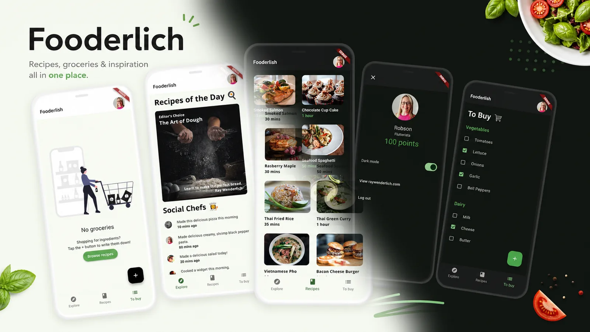

# Fooderlich

<p align="center">
  
</p>

A social recipe and grocery app for Flutter. It includes login and onboarding
flows, a recipe explorer, a grocery list with quantity/color pickers, dark mode,
and deep linking between screens.

## Getting Started

Requires Flutter 3.44+ (Dart 3.0+).

```sh
flutter pub get
flutter run
```

The app is an offline demo: recipes and posts come from a mock service, and
preferences persist locally via `shared_preferences`.

## Testing

```sh
flutter test --coverage
```

Runs the full suite (models, navigation, components and screens) with ~99% line coverage.

## Project layout

- `lib/models/` — state managers (`AppStateManager`, `GroceryManager`,
  `ProfileManager`) and domain models
- `lib/screens/` — UI screens and navigation pages
- `lib/components/` — reusable widgets
- `lib/navigation/` — custom `RouterDelegate`/`RouteInformationParser`
  (deep-linking aware)
- `lib/api/` — mock data source

## License

MIT — see [LICENSE](LICENSE).

## Notes

- Code structure follows the app built in the *Flutter Apprentice* book (Kodeco),
  updated to a modern Flutter toolchain in 2026. See the Third-Party Notices in
  [LICENSE](LICENSE) for the Kodeco license terms.
- Web view and deep links are wired for the raywenderlich.com flow used in the
  book.
- The test suite was added after the course and is not part of the book's
  material.
